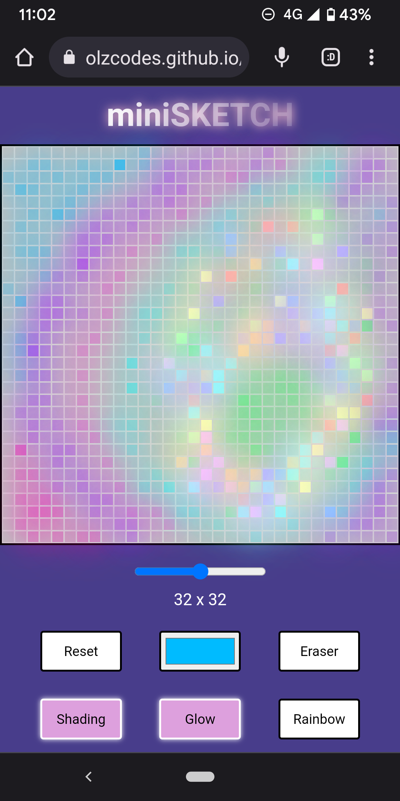
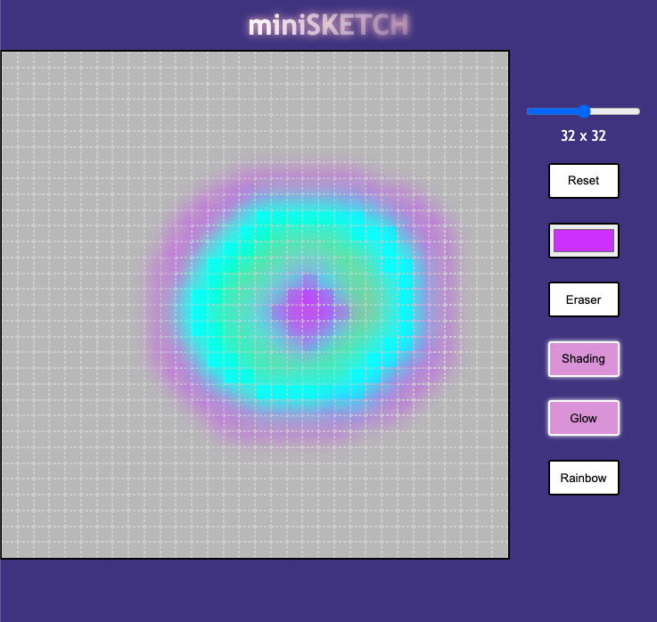

# miniSKETCH

**LIVE DEMO: https://olzcodes.github.io/minisketch/**

The aim of this project was to build a browser version of an Etch-A-Sketch drawing toy.

https://www.theodinproject.com/lessons/foundations-etch-a-sketch

## Screenshots

Mobile layout

Desktop layout

## To-Do

- [DONE] Create drawing canvas and drawing functionality
- [DONE] Add option to change canvas size
- [DONE] Add option to reset canvas
- [DONE] Make layout responsive
- [DONE] Add rainbow brush
- [DONE] Add eraser
- [DONE] Add glow mode
- [DONE] Add shading brush (incremental coloring)
- Add option to download sketch as PNG file
- Improve support for touch devices

## What I learnt from this project

- Generating hundreds of new DOM elements can affect performance and degrade UX drastically.
- It is easy to mess up a Git repository and trying to undo mistakes can be rather complicated.
- Each new feature potentially adds complexity to existing features.
